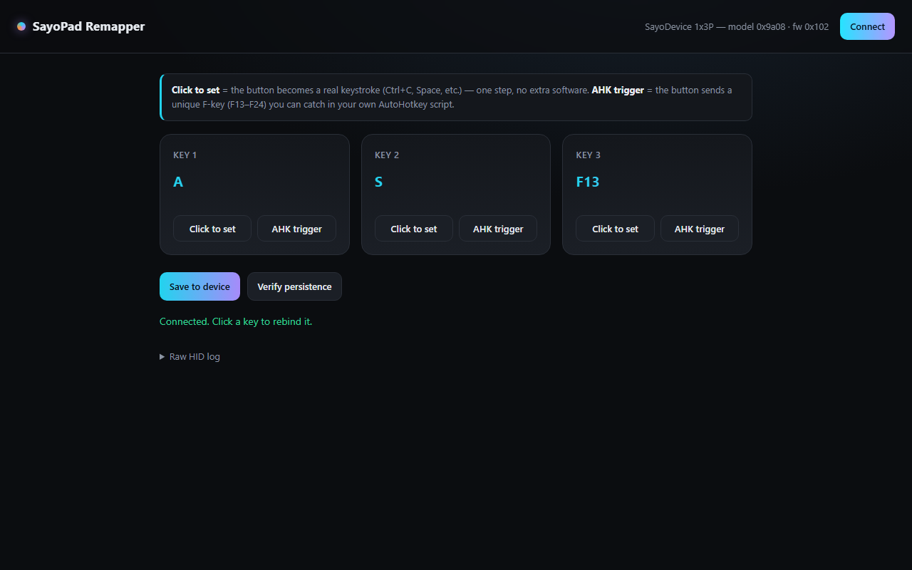

# SayoPad Remapper

Remap the 3 keys on a SayoDevice 1x3P macro pad from a browser tab, in Chrome, Firefox, or Safari.

## Features

- Read and rebind all 3 keys on the pad over USB HID
- **Click to set** - press any key (letters, digits, punctuation, function keys, arrows, numpad) and the pad sends that keystroke
- **AHK trigger** - assign one of F13-F24 so your own AutoHotkey script can catch it, for combos this analog firmware can't do on its own
- **Save to device** - commits all 3 bindings to the pad's onboard flash
- **Verify persistence** - writes a sentinel key, has you unplug/replug the pad, and tells you whether your firmware actually keeps flash writes across a power cycle
- Raw HID log panel showing every TX/RX packet, for debugging the wire protocol

## Requirements

- A SayoDevice 1x3P macro pad (VID `0x8089`)
- Python 3 with `hidapi` (`pip install hidapi` - `start.bat` does this for you on first run)
- Any browser - Chrome, Firefox, Edge, Safari all work

## Quick start

1. Plug in the pad.
2. Double-click **`start.bat`** (Windows), or run `python agent.py` after `pip install hidapi`.
3. Your browser opens at `http://localhost:17890` automatically.
4. Click **Connect**, then per key: **Click to set** for a single keystroke, or **AHK trigger** for an F13-F24 you catch in your own script.
5. Click **Save to device** to commit to flash. Use **Verify persistence** once to confirm your unit's firmware actually keeps writes across a reboot.

## How it works

Raw USB HID access from a browser normally means WebHID, and WebHID only works in Chromium. This project skips that limit: `agent.py` is a small local Python process that opens the pad directly with `hidapi` and exposes a JSON API on `http://localhost:17890` (`/api/connect`, `/api/keys`, `/api/key`, `/api/save`). The static page (`index.html`, `ui.js`, `client.js`) talks to that API over `fetch`, so the same UI works in any browser, not just Chrome.

The 1x3P is a hall-effect (analog) pad. Its per-key config is a 46-byte structure holding actuation and calibration data; the tap keycode lives at a fixed offset inside it. The agent reads the whole structure, edits only the keycode bytes, and writes it back, so your actuation tuning is never disturbed.

Because the UI depends on the local agent for every action (connect, read, write, save), it isn't hosted as a static site. Run it locally with `start.bat` or `python agent.py`.

## Files

- `agent.py` - local HID agent: USB protocol, localhost JSON API, static file server
- `index.html`, `styles.css` - UI markup and styling
- `ui.js` - UI logic and state
- `client.js` - localhost API client
- `keymap.js` - HID keycode tables
- `start.bat` - Windows launcher

## License

MIT, see [LICENSE](LICENSE).

---
Built by [Kitsune Technologies](https://kitsunetechnologies.org). See more of our work at [kitsunetechnologies.org/work](https://kitsunetechnologies.org/work). Issues and PRs welcome.
